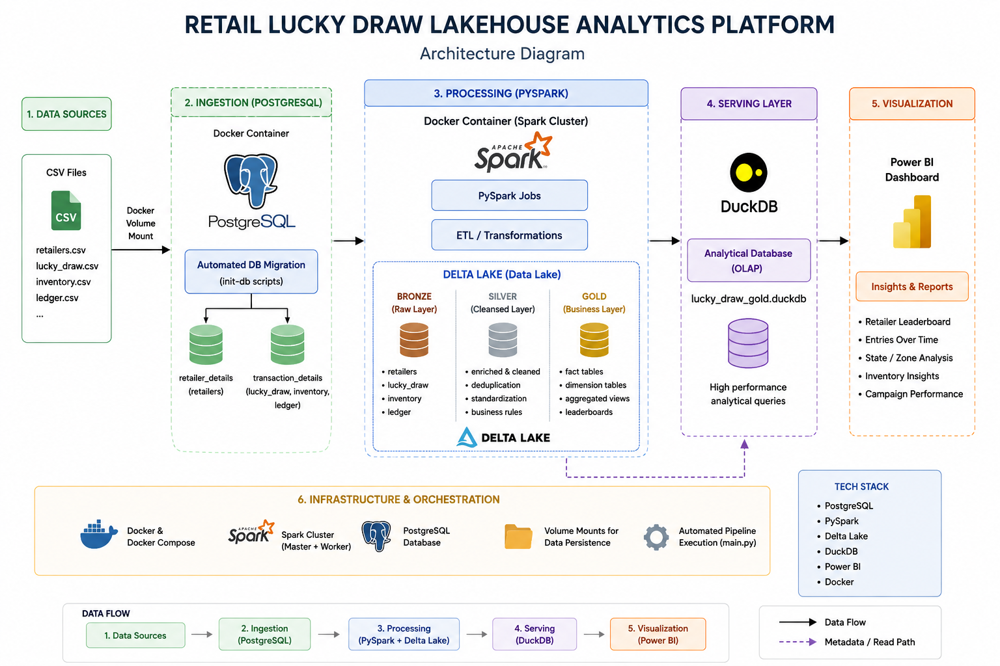
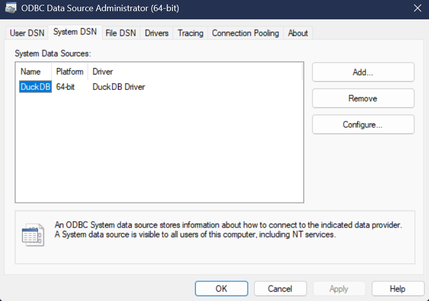
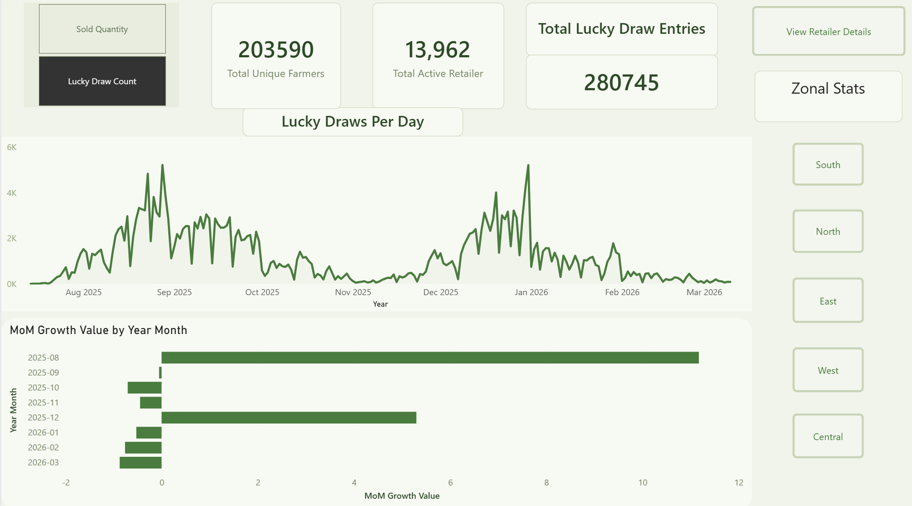
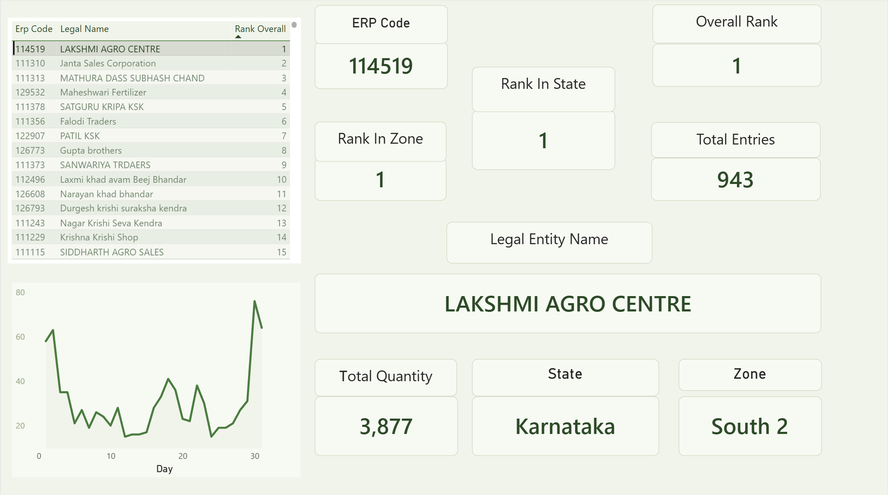
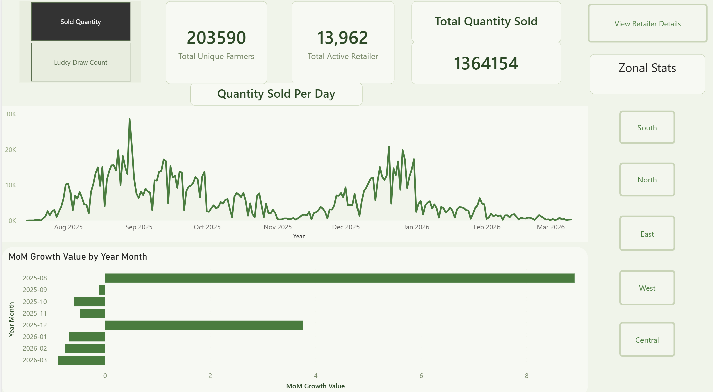
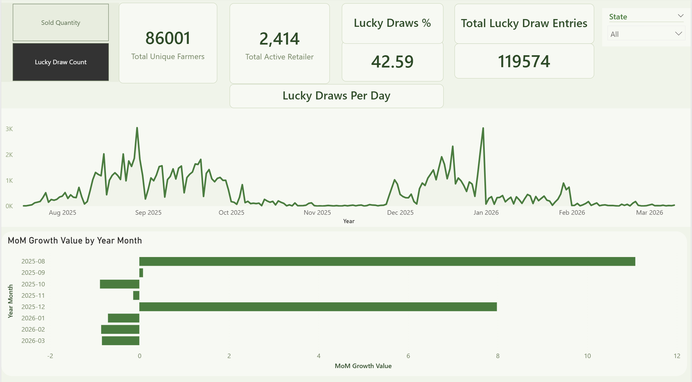
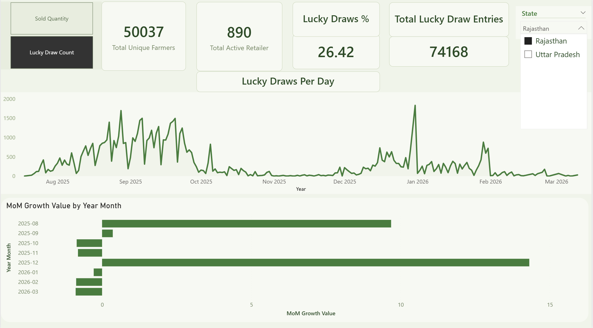

# Retail Lucky Draw Lakehouse Analytics Platform

## Overview

This project is a containerized lakehouse analytics platform built using PostgreSQL, PySpark, Delta Lake, DuckDB, Docker, and Power BI.

The platform simulates a real-world retailer lucky draw campaign system where farmers receive lucky draw entries based on product purchases made through retailers. The project demonstrates modern data engineering concepts including medallion architecture, distributed data processing, Delta Lake storage, analytical serving layers, and business intelligence reporting.

The pipeline performs:

* Automated PostgreSQL database initialization and CSV ingestion
* Bronze, Silver, and Gold medallion layer processing using PySpark
* Delta Lake-based storage and optimization
* Analytical export into DuckDB
* Power BI dashboarding through ODBC connectivity
* End-to-end containerized orchestration using Docker Compose

---

# Architecture

## High-Level Architecture



---

# Technology Stack

| Component               | Technology              |
| ----------------------- | ----------------------- |
| Database                | PostgreSQL              |
| Distributed Processing  | PySpark                 |
| Lakehouse Storage       | Delta Lake              |
| Analytical Query Engine | DuckDB                  |
| Visualization           | Power BI                |
| Containerization        | Docker & Docker Compose |
| File Format             | Parquet                 |

---

# Project Structure

```text
retail-lucky-draw-lakehouse/
│
├── screenshots/
├── init-db/
├── notebooks/
├── powerbi/
├── data/
├── app/
│   ├── config/
│   │   ├── settings.py
│   │   └── spark_session.py
│   │
│   ├── pipelines/
│   │   ├── extract_bronze.py
│   │   ├── silver_gold.py
│   │   └── duck_db.py
│   │
│   └── main.py
│
├── Formatted/
├── Dockerfile
├── docker-compose.yml
├── requirements.txt
└── README.md
```

---

# Data Pipeline Architecture

## Bronze Layer

The Bronze layer stores raw ingested data from PostgreSQL into Delta Lake tables.

Tables:

* retailers
* lucky_draw
* inventory
* ledger

Features:

* Raw source preservation
* Ingestion metadata columns
* Partitioning by year_month where applicable
* Delta format storage

---

## Silver Layer

The Silver layer performs cleansing, enrichment, and business rule transformations.

Transformations include:

* Retailer geographic enrichment
* Data quality filtering
* Quantity validation
* State-level aggregations
* Farmer profiling
* Inventory movement analytics
* Window-based calculations
* Ledger enrichment

Optimizations:

* Delta OPTIMIZE
* ZORDER indexing

---

## Gold Layer

The Gold layer contains analytics-ready dimensional and fact tables.

Gold tables:

* fact_lucky_draw_entries
* dim_date
* dim_retailer
* agg_retailer_leaderboard

These tables are exported into DuckDB for BI consumption.

---

# Dockerized Infrastructure

The entire platform is containerized using Docker Compose.

Services:

* PostgreSQL
* Spark Master
* Spark Worker
* Jupyter Environment
* Pipeline Runner

Features:

* Automated database migrations
* Automated CSV ingestion
* Spark cluster orchestration
* Persistent storage volumes
* End-to-end automated execution

---

# Database Initialization

The PostgreSQL container automatically:

1. Creates databases
2. Creates tables
3. Loads CSV files

Initialization scripts are located in:

```text
init-db/
```

CSV files are located in:

```text
Formatted/
```

---

# Environment Variables

Create a `.env` file in the project root directory.

Example:

```env
POSTGRES_USER=postgres
POSTGRES_PASSWORD=postgres
POSTGRES_HOST=postgres
POSTGRES_PORT=5432
```

The pipeline uses these variables to establish JDBC connections between Spark and PostgreSQL.

---

# How to Run the Project

## Step 1 — Clone Repository

```bash
git clone <repository-url>
cd Retailer_analytics
```

---

## Step 2 — Create Environment File

Create a `.env` file in the project root.

Example:

```env
POSTGRES_USER=postgres
POSTGRES_PASSWORD=postgres
POSTGRES_HOST=postgres
POSTGRES_PORT=5432
```

---

## Step 3 — Build and Start Containers

```bash
docker compose up --build
```

This command:

* Starts PostgreSQL
* Executes database migrations
* Loads CSV data
* Starts Spark cluster
* Runs PySpark pipeline
* Creates Delta Lake layers
* Exports Gold tables into DuckDB

---

# DuckDB Integration

The Gold layer is exported into a DuckDB database:

```text
/opt/spark-data/duckdb/lucky_draw_gold.duckdb
```

DuckDB serves as the analytical serving layer for Power BI.

---

# Power BI Integration using ODBC

Power BI is connected to DuckDB using the DuckDB ODBC Driver.

## Step 1 — Install DuckDB ODBC Driver

Download and install the DuckDB ODBC Driver from the official DuckDB documentation.

Official Website:

[https://duckdb.org/docs/api/odbc/overview](https://duckdb.org/docs/api/odbc/overview)

---

## Step 2 — Configure ODBC Data Source

1. Open ODBC Data Sources (64 bit) on Windows
2. Create a new System DSN
3. Select DuckDB Driver
4. Point the database path to:

```text
lucky_draw_gold.duckdb
```
## ODBC Configuration Screenshots


---

## Step 3 — Connect Power BI

1. Open Power BI Desktop
2. Select:

```text
Get Data → ODBC
```

3. Choose the configured DuckDB DSN
4. Load Gold tables into Power BI

---

# Dashboard Features

The Power BI dashboard provides multi-level analytical insights for retailer and lucky draw campaign performance.

Key features include:

* KPI toggle between:

  * Product quantity sold
  * Number of lucky draw entries

* Zone-wise performance analytics

* State-wise drill-down analysis within each zone

* Retailer performance and profiling

* Month-over-Month (MoM) trend analysis

* Daily sales and entry tracking

* Retailer ranking and leaderboard analytics

* Campaign participation analysis

* Geographic performance segmentation

* Inventory movement insights

# Dashboard Screenshots

## Dashboard Overview



---

## Retailer Leaderboard



---

## Inventory Analytics



---

## Regional Analysis



---



---

# Key Engineering Concepts Demonstrated

* Medallion Architecture
* Distributed Data Processing
* Delta Lake Storage
* Partitioned Data Lake Design
* Analytical Serving Layers
* Window Functions and Aggregations
* Containerized Data Engineering Pipelines
* Automated Database Migrations
* BI Integration using DuckDB and ODBC

---

# Future Enhancements

Potential future improvements:

* Airflow orchestration
* Incremental processing
* Streaming ingestion
* Cloud object storage integration
* Delta MERGE-based upserts
* Data quality monitoring
* CI/CD pipeline integration

---

# Author

Rahul Athreya
